# Harness 五子系统模型

> 来源：Learn Harness Engineering 课程（Walking Labs），2026

## 概述

Harness（马具/脚手架）是模型权重之外的一切工程基础设施。本模型将 harness 分为五个子系统，每个有明确的职责和评判标准。

OpenAI 将工程师的核心工作概括为三件事：**设计环境、表达意图、构建反馈循环**。
Anthropic 直接把 Claude Agent SDK 称为"通用 agent harness"。

## 五大子系统

```mermaid
graph TD
    subgraph 指令
        A1[AGENTS.md/CLAUDE.md] --> A2[入口文件 50-200行]
        A2 --> A3[按需展开 专题文档]
    end
    subgraph 工具
        B1[Shell访问] --> B2[API/Function calling]
        B2 --> B3[MCP Server]
    end
    subgraph 环境
        C1[仓库即规范] --> C2[依赖/配置齐全]
        C2 --> C3[验证命令就绪]
    end
    subgraph 状态
        D1[PROGRESS.md] --> D2[DECISIONS.md]
        D2 --> D3[git检查点]
    end
    subgraph 反馈
        E1[三层终止校验] --> E2[面向agent的错误消息]
        E2 --> E3[审查反馈提升]
    end
```



### 1️⃣ 指令子系统

**职责**：告诉 agent 这是什么项目、怎么用、哪些红线不能碰。

关键产出：
- **入口文件**（AGENTS.md / CLAUDE.md）— 50-200 行，项目概览 + 运行命令 + 硬约束 + 文档链接
- **专题文档** — 按主题放在 docs/ 或对应模块目录下，agent 按需加载

设计原则：
- **给地图，不给说明书** — 入口文件是目录页，不是百科全书
- **约束而非微操** — 用可执行的规则约束，而不是逐条叮嘱
- **利用 Lost in the Middle 效应** — 重要信息放顶部或底部

负面模式：指令膨胀 → 中间迷失 → 优先级冲突 → 维护衰减 → 矛盾累积

### 2️⃣ 工具子系统

**职责**：确保 agent 有足够的工具访问权限。

关键考量：
- Shell 访问（不要因为安全考虑完全禁用）
- API/Function Calling
- MCP Server（如 Puppeteer、数据库、文件系统等）
- 工具安全与权限控制

### 3️⃣ 环境子系统

**职责**：仓库作为唯一事实来源，依赖/配置/验证全部就绪。

核心原则：
- **仓库即规范（Repo as System of Record）** — 仓库里不存在的信息对 agent 来说 = 不存在
- **ACID 类比**：
  - 原子性：每次逻辑操作用 git commit 原子化
  - 一致性：定义验证谓词（测试通过、lint 无报错）
  - 隔离性：多个 agent 用独立进度文件或 git 分支
  - 持久性：跨会话知识必须写到 git 跟踪的文件里

检测工具：**全新会话测试** — 开全新 agent 会话能否回答五个基本问题

### 4️⃣ 状态子系统

**职责**：跨会话状态持久化，防止上下文焦虑和漂移。

三个核心工具：
1. **PROGRESS.md** — 当前状态、已完成项、进行中项、已知问题、下一步
2. **DECISIONS.md** — 重要设计决策（什么决策 + 为什么 + 否决方案）
3. **git 检查点** — 每完成一个原子工作单元就提交

**上下文焦虑**：Anthropic 观察到 agent 在接近上下文限制时匆忙收尾。
- 压缩（Compaction）：保留连续性但丢失"为什么"
- 重置（Reset）：状态干净但依赖工件完备性
- 混合策略：短任务会话内完成，长任务用结构化工件交接

关键指标：**重建成本** — 新会话恢复到可执行状态所需时间，好的 harness 应 <3 分钟。

### 5️⃣ 反馈子系统

**职责**：提供可验证的完成定义，防止 agent 提前宣告完成。

核心机制：
- **三层终止校验**：语法/静态分析 → 运行时行为验证 → 系统级端到端确认
- **完成证据必须可执行**："curl 返回 201"才算完成，"代码看起来没问题"不算
- **面向 agent 的错误消息**：包含"什么出了问题 + 为什么 + 怎么修"
- **审查反馈提升**：每次发现重复问题就加一条自动化规则

## 五子系统间的依赖关系

```
指令 → 工具 → 环境 → 状态 → 反馈
        ↑                    |
        └────────────────────┘
```

指令告诉 agent 用什么工具，工具操作环境，环境产生状态变化，反馈验证结果并回传给指令修正。

## 适用场景

- 搭建 agent 编码工作环境
- 诊断 agent 失败原因（归因到具体子系统）
- 评估和改进已有 harness
- 多 session 长时间运行的任务

## 相关 Wiki 页面

- [agent-harness-engineering](../concepts/agent-harness-engineering.md) — 已有的一页式对比
- [anthropic-harness-deep-analysis](../queries/anthropic-harness-deep-analysis.md) — Anthropic harness 深度分析
- [cursor-harness-deep-analysis](../queries/cursor-harness-deep-analysis.md) — Cursor harness 分析
- [self-driving-codebases](../concepts/self-driving-codebases.md)
- [multi-agent-architectures](../concepts/multi-agent-architectures.md)